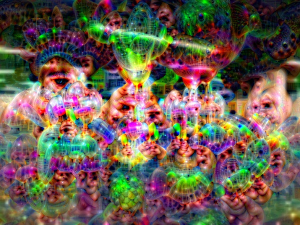

# The DeepDream Experiments &#129302;&#128164;

This crazy and fantistic effect is inspirated by [DeepDream by Google]([https://github.com/gordicaleksa/pytorch-deepdream/blob/master/deepdream.py](https://research.google/blog/inceptionism-going-deeper-into-neural-networks/)). And it will provide the power to create these weird, psychedelic-looking images.

  

This notebook is associated with the [Google DeepDream algorithm](https://ai.googleblog.com/2015/06/inceptionism-going-deeper-into-neural.html),[DeepDream | Tensorflow](https://www.tensorflow.org/tutorials/generative/deepdream?hl=zh-cn) and [pytorch-deepdream by Aleksa Gordić](https://github.com/gordicaleksa/pytorch-deepdream/blob/master/deepdream.py) !

  

DeepDream is an artistic algorithm where a pretrained CNN is fed an image and optimized to amplify the features it "dogs" in the image.
In this project I'll be focusing on CNN: the VGG16, the dataset is ImageNet. Depending on the neural network layer the features amplified will either be low level (like edges, certain geometric patterns, etc.) or high level (like dog snouts, eyes, etc.)

## Table of Contents
* [What is DeepDream?](#what-is-deepdream)
* [How to use](#How-to-use)
* [Samples of Deep Dream pictures](#Samples-of-Deep-Dream-pictures)
* [Problem I met](#Challenge)
* [Learning material](#Reference)

## What is DeepDream?
DeepDream is a computer vision program created by Google engineer Alexander Mordvintsev that uses a convolutional neural network to find and enhance patterns in images via algorithmic pareidolia, thus creating a dream-like appearance reminiscent of a psychedelic experience in the deliberately overprocessed images.--[Wikipadia.DeepDream](https://en.wikipedia.org/wiki/DeepDream).

So from an input image like the one on the left after "dreaming" we get the image on the right:

## How to use
which part I can adjust.
#### Option 1: Image Loading, change the name of image in /data

#### Option 2: Lay_of_use
`config['layers_to_use'] = ['relu5_3'] `

#### Option 3: pyramid_sizes and pyramid_ratio
`pyramid_sizes = [1, 3, 5]`   `config['pyramid_ratio'] = 1.8 ` 

#### Option 4: Lr and iterations
`num_gradient_ascent_iterations = [2, 5, 20]` `config['lr'] = 0.09`  

## Samples of Deep Dream pictures
#### 1.Impact of increasing the pyramid size

Going from left to right the only parameter that changed was the pyramid size (from left to right: 1, 3, 4 levels).

#### 2.Impact of layer of use

Going from left to right the only parameter that changed was the layer (from left to right: relu5_1, relu3_3, relu4_2).

#### 3.Impact of iterations

Going from left to right the only parameter that changed was the number of iterations (from left to right: 2, 5, 10).

## Challenge
1.The error I met
But I failed to use the tensorflow core, It always show that the 'keras' is mot defined, although I have check that the version of my tensorflow, make sure that the offical tensorflow contain the keras- gpu, and I have tried several version, it still does not work, so I back to pytorch to work on my project.
The error shows that
`AttributeError: module ‘tensorflow’ has no attribute ‘keras’`

2.I want to try to import the videos into deepdream, but my computer doesn't seem to be able to work with so many images, it always crashes! 
&#128128;

## Reference
I don't use any AI in my coding, The quoted code, which I have labeled in the notebook `deepdream.ipynb`

  

the sample of reference :)

These notebook I have used in my project:
* [deepdream](https://github.com/google/deepdream) 
* [DeepDream_TensorFlow_Core](https://github.com/samim23/DeepDreamAnim) (TensorFlow)
* [AI-Art](https://github.com/Adi-iitd/AI-Art/blob/master/DeepDream.py) (PyTorch)
* [DeepDream.py](https://github.com/gordicaleksa/pytorch-deepdream/tree/master) (PyTorch)
* [neural-dream](https://github.com/ProGamerGov/neural-dream) (PyTorch)

I found the images I was using here:
* [Test](https://www.pinterest.co.uk/pin/5770305767404576/)
* [bridge](https://www.pexels.com/photo/gray-bridge-and-trees-814499/)

Thanks for the notebook from Google Deepdream & Pytorch-Deepdream by Aleksa Gordić &#128512;
